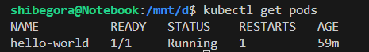
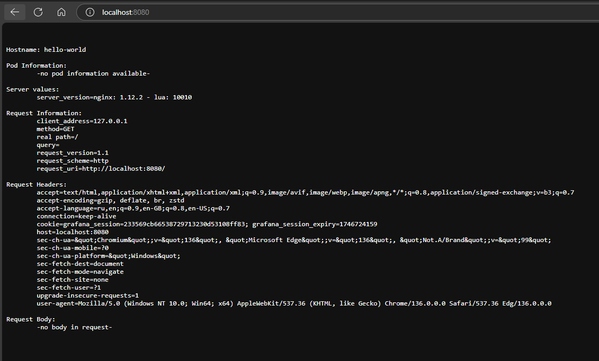
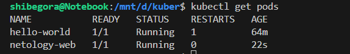
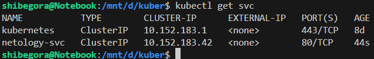
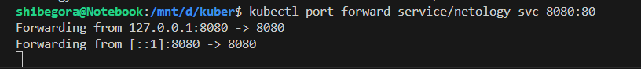
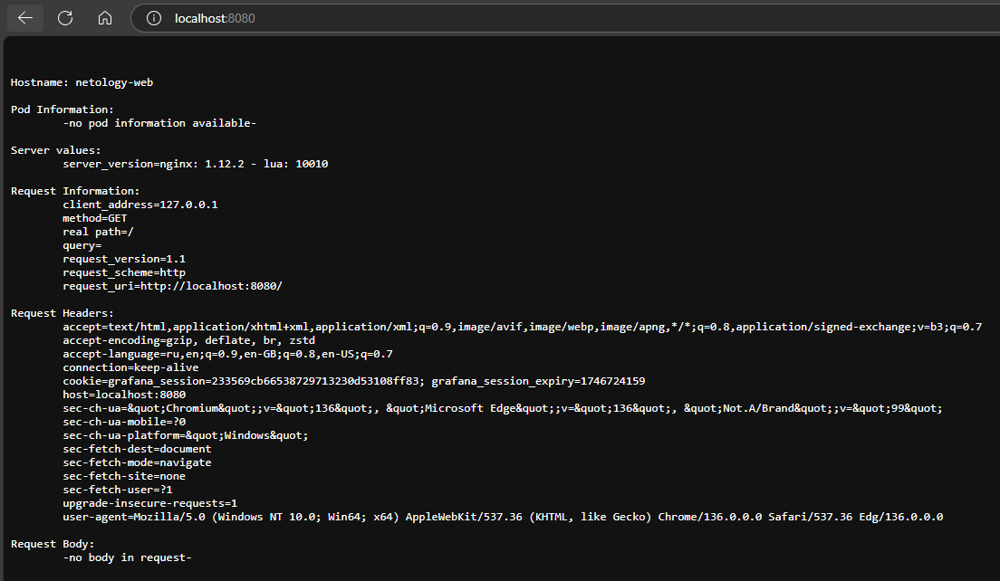

Задание 1. Создать Pod с именем hello-world


Использовать image - gcr.io/kubernetes-e2e-test-images/echoserver:2.2.
```
apiVersion: v1
kind: Pod
metadata:
  name: hello-world
  labels:
    app: web
spec:
  containers:
  - name: echoserver
    image: gcr.io/kubernetes-e2e-test-images/echoserver:2.2
```

Подключиться локально к Pod с помощью kubectl port-forward и вывести значение (curl или в браузере).


Задание 2. Создать Service и подключить его к Pod
Создать Pod с именем netology-web.


Создать Service с именем netology-svc и подключить к netology-web.


Подключиться локально к Service с помощью kubectl port-forward и вывести значение (curl или в браузере).

