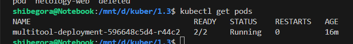
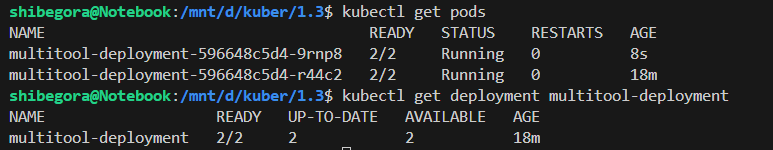
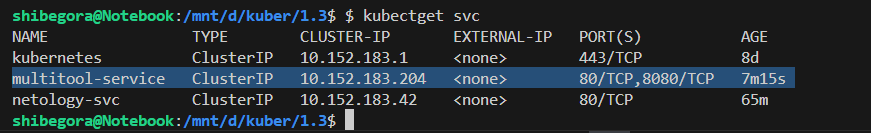
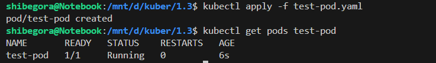
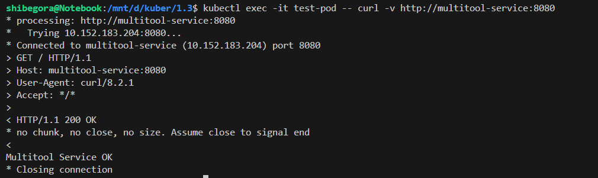
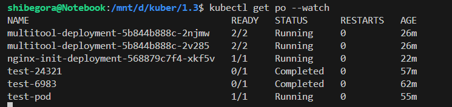

Задание 1. Создать Deployment и обеспечить доступ к репликам приложения из другого Pod
Создать Deployment приложения, состоящего из двух контейнеров — nginx и multitool. Решить возникшую ошибку.

После запуска увеличить количество реплик работающего приложения до 2.

Создать Service, который обеспечит доступ до реплик приложений из п.1.

Создать отдельный Pod с приложением multitool и убедиться с помощью curl, что из пода есть доступ до приложений из п.1.

Создать Deployment приложения nginx и обеспечить старт контейнера только после того, как будет запущен сервис этого приложения.

