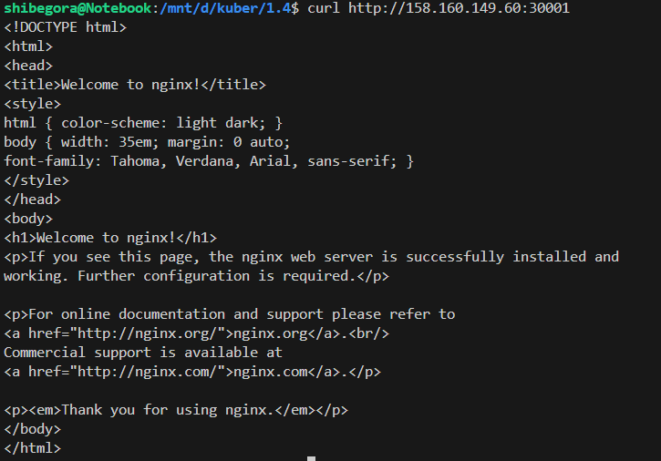

Задание 1. Создать Deployment и обеспечить доступ к контейнерам приложения по разным портам из другого Pod внутри кластера
Pod multitool и запрос curl с него

На 9001 и на 9002

Задание 2. Создать Service и обеспечить доступ к приложениям снаружи кластера
Запрос с браузера 30001

Запрос с браузера 30002

Curl 30001

Curl 30001

