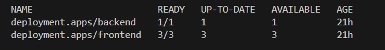
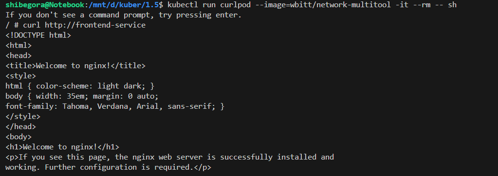
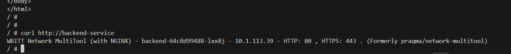
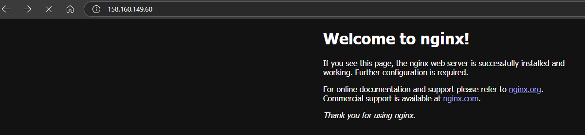
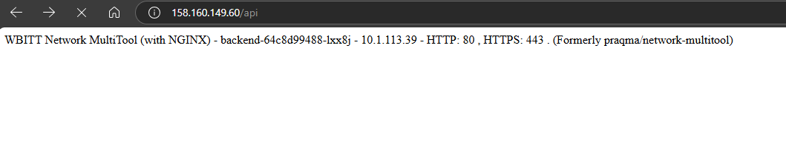

Задание 1. Создать Deployment приложений backend и frontend

Создать Deployment приложения frontend из образа nginx с количеством реплик 3 шт.
Создать Deployment приложения backend из образа multitool.

Продемонстрировать, что приложения видят друг друга с помощью Service.

Задание 2. Создать Ingress и обеспечить доступ к приложениям снаружи кластера

Доступ через /

Доступ через /api

