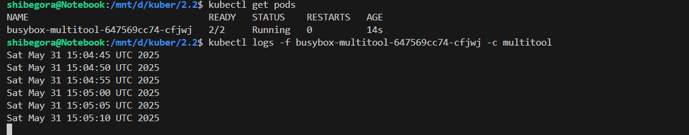
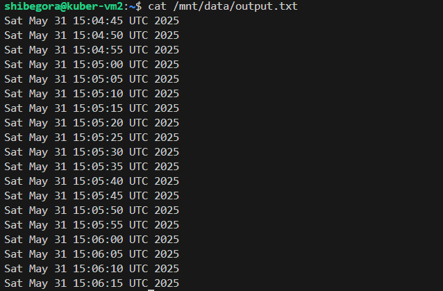

Задание 1. Создать Deployment приложения, использующего локальный PV, созданный вручную.
Чтение файла с multitool, в который пишет busybox


Удалить Deployment и PVC. Продемонстрировать, что после этого произошло с PV. Пояснить, почему.

Это произошло потому, что удалил PV явно с помощью kubectl delete -f busybox-multitool.yaml.
В YAML-файле local-pv был явно включён, и при удалении манифеста — Kubernetes удаляет все включённые ресурсы, включая сам PV.

Продемонстрировать, что файл сохранился на локальном диске ноды. Удалить PV. Продемонстрировать что произошло с файлом после удаления PV. Пояснить, почему.

Файл должен быть доступен, потому что PV использует локальную директорию на хосте, и данные сохраняются на этом диске.

Задание 2. 
Включить и настроить NFS-сервер на MicroK8S.


Созданные pod, pv, pvc


Создать Deployment приложения состоящего из multitool, и подключить к нему PV, созданный автоматически на сервере NFS.


в деплойменте в контейнере multitool есть команда:
while true; do date >> /mnt/nfs/output.txt; sleep 5; done
команда пишет в файл каждые 5 секунд — это и есть демонстрация записи.

Через команду 
```
echo "Hello from inside pod" >> /mnt/nfs/output.txt
```
вручную внес запись 
