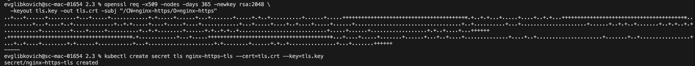

## Задание 1

Поды поднялись 

Проброшенные порты

Доступ до страницы открывается по внешнему адресу + порт

index.html в смонтированной директории

## Задание 2.  Создать приложение с вашей веб-страницей, доступной по HTTPS

Поды поднялись

Генерим самоподписанный сертификат

Доступ по https из service

curl запрос через терминал

Страница доступна из веба

Сертификат самоподписанный
